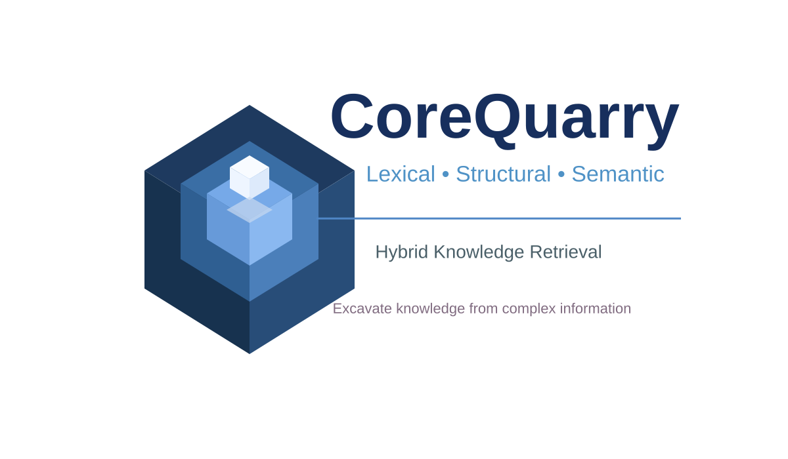

# CoreQuarry

*A search and retrieval engine for humans and agents built to run on the hardware you already own.*

Source: <https://github.com/re-Isearch/CoreQuarry> · Licensed under the [Apache License 2.0](#license)

A zero-dependency, C++ hybrid retrieval kernel designed for offline RAG infrastructure and agentic search. CoreQuarry implements structure-preserving indexing directly over ggml tensors, completely bypassing the need to maintain external database containers or deploy heavy, multi-layered Python orchestration libraries.

Why this matters:
* Zero Abstraction Bloat: Eliminates the network serialization overhead found in typical client-server architectures.
* Preserved Data Schemas: Retains parent-child relationship graphs natively, preventing the metadata loss caused by typical text-splitting algorithms.

* Bare-Metal Speed: Compiles directly into standard C/C++ targets, utilizing local hardware acceleration (CUDA, Metal, Vulkan) for tensor math.

## Why is this a game changer for Agents

Large language models are remarkably good at language. They can recognise semantic similarity, infer unstated relationships, synthesise information across passages, and reason over text whose meaning is expressed implicitly rather than formally.

But text is more than a sequence of words.

Documents also have structure: passages contain other passages; annotations overlap; entities participate in several structures at once; a quotation may cross the boundary of an editorial section; a claim can be linked to evidence elsewhere; linguistic, scholarly and domain-specific annotations can coexist over the same words. When documents are reduced to chunks for conventional RAG, much of this information is either flattened or lost.

Some have attempted to use pure structural trees and graphs. They, however, fall apart when trying to handle progressive textual dimensions for two reasons: 
* 1. The Overlapping Hierarchy Problem: Text often requires multiple concurrent, non-nested structures. If you want to model a text tree based on logical structure (chapters, paragraphs, sentences) while simultaneously modeling a graph based on physical structure (pages, lines, columns), a single tree cannot do both without breaking. A token progression belongs to both structures simultaneously. 
* 2. Loss of Relative Spatial Distance: In a pure tree, the distance between the last token of Paragraph 1 and the first token of Paragraph 2 looks structurally identical to the distance between two paragraphs miles apart in content. Trees do not have a natural concept of a continuous metric scale or flow. 

In the 1980's, Gaston Gonnet-- “Unstructured Data Bases” (1983)-- and HyTime's-- Hypermedia/Time-based Structuring Language (ISO/IEC 10744:1992)-- great breakthrough was realization that one could use coordinate mathematics to map relationships between disparate layers of text and media. CoreQuarry resurrects this exact line of thinking for AI-- while exploiting the massive improvements in I/O latency and massive scaling of Input/Output Operations Per Second (IOPS) that historically constrained the paradigm. So instead of forcing a model to read an entire document blindly, CoreQuarry can provide a structured "retrieval algebra." An AI agent can use boolean, positional, and structural operators to navigate the text coordinates explicitly. It can ask for "the token sequence between position X and Y, but only if it falls within the boundaries of a specific speaker tag," exactly mirroring the coordinate-based addressing found in HyTime. It records the exact physical positions and boundaries of terms and schemas at the engine layer. CoreQuarry makes that structure queryable.

The result can be thought of as a **textual graph**—but it is importantly different from a conventional graph. Text has *spatiality*. Its structures are anchored in a shared textual space, and relationships such as **before, after, within, contains, overlaps and intersects** arise from that space itself. Two annotations do not merely have an abstract edge between them: they may occupy, share or cross regions of the same underlying text.

This gives RAG a form of structure that complements the strengths of the LLM.

The LLM can do what it does best: interpret language, recognise relevance, synthesise evidence and generate an answer. CoreQuarry can do something different: determine precisely which textual structures are related, how they intersect, and which context should be assembled for the model.

Instead of forcing the LLM to reconstruct document structure from flattened chunks, the retrieval layer can provide that structure explicitly.

This changes the role of retrieval. Vector similarity can answer **“what text is semantically related?”** Structural search can additionally answer **“where does this occur, what contains it, what overlaps it, what is it connected to, and which surrounding material belongs with it?”**

The combination creates a richer form of RAG: semantic reasoning over context assembled from the actual structure of the source, rather than from arbitrary chunk boundaries.

CoreQuarry therefore provides something between text and a knowledge graph: a queryable structural representation that preserves the spatial character of text. It allows an LLM to operate not simply on retrieved passages, but on selected regions of a structured textual space.

## Operators
We've created a very powerful query algebra. 
<PRE>
Op  	Arity	RPN-syntax	Description
---------------------------------------------- 
OR	Binary	A B OR	Union: returns records matching either operand.
AND	Binary	A B AND	Intersection: returns records matching both operands.
MAYBE	Binary	A B MAYBE	Return records matching both A and B when possible; if there are no common matches, return the operand with the larger result set. Ties are broken by choosing the operand with the higher maximum score.
NARROW	Binary	A B NARROW	Return records matching both A and B when possible; if there are no common matches, return the operand with the smaller result set. Ties are broken by choosing the operand with the higher maximum score.
PROMOTE	Binary	A B PROMOTE	A promotes B: Return records matching B; where a record also matches A, increase its score using A’s score. A does not contribute hit evidence
DEMOTE	Binary	A B DEMOTE	A demotes B: Return records matching B; where a record also matches A, decrease its score using A’s score. A does not contribute hit evidence.
ANDNOT	Binary	A B ANDNOT	A and not B (Difference): returns records matching A but not B.
NOTAND	Binary	A B NOTAND	Reverse difference: equivalent to B A ANDNOT.
XOR	Binary	A B XOR	Exclusive union: returns records matching exactly one operand.
XNOR	Binary	A B XNOR	Equivalence: returns records for which both operands have the same match state.
NAND	Binary	A B NAND	Complement of intersection: equivalent to A B AND NOT.
NOR	Binary	A B NOR	Complement of union: equivalent to A B OR NOT.
NOT	Unary	A NOT	Set complement: returns records not contained in A.
SIBLING	Unary	EXPRESSION SIBLING	Postfix structural modifier that rewrites a compatible expression as a same-container PEER expression.
ADJ	Binary	A B ADJ	Returns matches whose terms are immediately adjacent or within the engine's tight adjacency distance.
NEAR	Binary	A B NEAR[:distance]	Returns matches whose hits are near one another. An integer distance is measured in source positions; a fractional or percent distance is relative to the record size.
PROXIMITY	Binary	A B PROXIMITY:distance | A B DIST[<|<=|>|>=]distance	General distance relation between operand hits. DIST comparison forms select hits whose source distance satisfies the specified relation.
BEFORE	Binary	A B BEFORE[:distance]	Ordered proximity: returns matches where A occurs before B within the specified or default distance.
AFTER	Binary	A B AFTER[:distance]	Ordered proximity: returns matches where A occurs after B within the specified or default distance.
NEIGHBOR	Binary	A B NEIGHBOR	Character-proximity relation using a record-relative neighborhood.
FOLLOWS	Binary	A B FOLLOWS	Tight ordered proximity requiring A to follow B.
PRECEDES	Binary	A B PRECEDES	Tight ordered proximity requiring A to precede B.
FAR	Binary	A B FAR	Returns matches whose hits are structurally separate or beyond the engine's default near distance.
PEER	Binary	A B PEER	Returns matches whose hits occur within the same immediate non-root structural container.
PEERb	Binary	A B PEERb	Ordered PEER relation using BEFORE ordering within the same immediate structural container.
PEERa	Binary	A B PEERa	Ordered PEER relation using AFTER ordering within the same immediate structural container.
XPEER	Binary	A B XPEER	Returns matches whose hits do not occur within the same immediate structural container.
ANCESTOR	Binary	A B ANCESTOR	Returns matches whose hits share a common non-root structural ancestor.
AND:field	Binary	A B AND:<field>	Returns matches whose operand hits occur within the same instance of the named field.
OR:field	Binary	A B OR:<field>	Returns matches from either operand constrained to the named field.
BEFORE:field	Binary	A B BEFORE:<field>	Returns matches where A occurs before B within the same instance of the named field.
AFTER:field	Binary	A B AFTER:<field>	Returns matches where A occurs after B within the same instance of the named field.
WITHIN	Unary	A WITHIN:<field-or-date-range>	Restricts A to hits within the named field, or to records within the specified date range. In RPN, term WITHIN:field and field/term are equivalent.
XWITHIN	Unary	A XWITHIN:<field>	Returns records from A having no hits within the named field.
INCLUSIVE	Unary	A INCLUSIVE:<field>	Returns records from A only when all retained hits are within the named field.
NOT:field	Unary	A NOT:<field>	Excludes matches occurring within the named field.
INSIDE	Unary	A INSIDE:<field>	Reserved structural containment operator. This form may not be supported by every result-set implementation.
WITHKEY	Unary	A WITHKEY:<pattern>	Restricts A to records whose record key matches the specified pattern.
FILE	Unary	A FILE:<pattern>	Restricts A to records whose local source pathname matches the pattern.
EXTENSION	Unary	A EXTENSION:<extension>	Restricts A to records whose source filename has the specified extension.
DOCTYPE	Unary	A DOCTYPE:<name>	Restricts A to records associated with the specified document type.
KEY	Identity	KEY:<pattern>	Produces a result set containing records whose key matches the pattern.
FILE	Identity	FILE:<pattern>	Produces a result set containing records whose local source pathname matches the pattern.
REDUCE	Unary	A REDUCE:<count>	Reduces A to records matching at least the requested number of distinct query terms. REDUCE:0 uses the maximum distinct-term count found in A.
FOCUS	Unary	A FOCUS:<count>	Prefers or retains records with stronger joint evidence from multiple query terms.
HITCOUNT	Unary	A HITCOUNT:<count> | A HITCOUNT[<|<=|>|>=]<count>	Retains records whose number of hits satisfies the requested count or comparison.
TRIM	Unary	A TRIM:<count>	Truncates A to at most count records. TRIM:0 produces an empty set.
BOOST	Unary	A BOOST:<weight>	Multiplies or increases the scores in A by the specified weight.
SORTBY	Unary	A SORTBY:<criterion>	Sorts A by a supported criterion such as Key, Hits, Date, Index, Score, AuxCount, Newsrank, Category, or a reverse-order variant.
JOIN	Binary	A B JOIN	Joins two result sets across physical indexes using the configured join relationship.
JOINL	Binary	A B JOINL	Left-oriented cross-index join.
JOINR	Binary	A B JOINR	Right-oriented cross-index join.
NOOP	Identity	NOOP	Performs no query operation.
</PRE>

## Data Types
Every field/container/path is a lexical type but may also be optionally a data-type. 
The following fundamental data types are currently supported (v.44.20): <PRE>
   any  	// Any
   string  	// String (full text)
   numerical  	// Numerical IEEE floating
   computed  	// Computed Numerical
   range  	// Range of Numerbers
   date  	// Date/Time in any of a large number of well defined formats
   date-range  	// Range of Date as Start/End but also +N Seconds (to Years)
   gpoly  	// Geospatial n-ary bounding coordinates
   box  	// Geospatial bounding box coordinates (N,W,S,E)
   time  	// Numeric computed value for seconds since 1970, used as date.
   ttl  	// Numeric computed value for time-to-live in seconds.
   expires  	// Numeric computed ttl value as date of expiration.
   boolean  	// Boolean type
   currency  	// Non-negative monetary value (fixed precision)
   dotnumber  	// Dot number (Internet v4/v6 Addresses, UIDs etc)
   phonetic  	// Computed phonetic hash applied to each word (for names)
   phone2  	// Phonetic hash applied to the whole field
   metaphone  	// Metaphone hash applied to each word (for names)
   metaphone2  	// Metaphone hash (whole field)
   hash  	// Computed 64-bit hash of field contents
   casehash  	// Computed case-independent hash of text field contents
   lexi  	// Computed case-independent lexical hash (first 8 characters)
   smiles  	// Computed SMILES (Chemical) hash // OPTIONAL FEATURE
   privhash  	// Undefined Private Hash (callback)
   isbn  	// ISBN: International Standard Book Number
   telnumber  	// ISO/CCITT/UIT Telephone Number
   iin  	// Issuer Identification (Credit/Debit Card) Number
   iban  	// IBAN: International Bank Account Number
   bic  	// BIC : International Identifier Code (SWIFT)
   db_string  	// Embedded (public) key/value store (gdbm).
   callback  	// Local callback 0 (External)
   local1  	// Local callback 1 (External)
   local2  	// Local callback 2 (External)
   local3  	// Local callback 3 (External)
   local4  	// Local callback 4 (External)
   local5  	// Local callback 5 (External)
   local6  	// Local callback 6 (External)
   local7  	// Local callback 7 (External)
   hnsw_raw  	// .hix
   hnsw  	// Hierarchical Navigable Small Worlds (HNSW) (NOT ENABLED)
   hnsw2  	// .hix
   hnsw3  	// .hix
   nsg  	// Spread Out Graph ANNS algorithms (NSG) // NOT YET
   ivfflat  	// IVFFlat Vectors // NOT YET
   special  	// Special text (reserved)
They are also available via the following alternative 'compatibility' names:
   text     	// Alias of string
   num     	// Alias of numerical
   number     	// Alias of numerical
   num-range     	// Alias of range
   numrange     	// Alias of range
   numericalrange     	// Alias of range
   numerical-range     	// Alias of range
   daterange     	// Alias of date-range
   duration     	// Alias of date-range
   bounding-box     	// Alias of box
   boundingbox     	// Alias of box
   phonhash     	// Alias of phonetic
   name     	// Alias of metaphone
   lastname     	// Alias of metaphone2
   hashcase     	// Alias of casehash
   hash1     	// Alias of privhash
   tel     	// Alias of telnumber
   telnum     	// Alias of telnumber
   phone     	// Alias of telnumber
   telephone     	// Alias of telnumber
   creditcard     	// Alias of iin
   inet     	// Alias of dotnumber
   ipv4     	// Alias of dotnumber
   ipv6     	// Alias of dotnumber
   xs:string     	// Alias of string
   xs:normalizedString     	// Alias of string
   xs:boolean     	// Alias of boolean
   xs:decimal     	// Alias of numerical
   xs:integer     	// Alias of numerical
   xs:long     	// Alias of numerical
   xs:int     	// Alias of numerical
   xs:short     	// Alias of numerical
   xs:unsignedLong     	// Alias of numerical
   xs:unsignedInt     	// Alias of numerical
   xs:unsignedShort     	// Alias of numerical
   xs:positiveInteger     	// Alias of numerical
   xs:nonNegativeInteger     	// Alias of numerical
   xs:negativeInteger     	// Alias of numerical
   xs:positiveInteger     	// Alias of numerical
   xs:dateTime     	// Alias of date
   xs:time     	// Alias of time
</PRE>

## Interface

These days it seems most agents flourish best with CLIs. We provide a very full-featured CLI with self-documenation. <PRE>
quarry search -d db [options] term...
options:

database:
  -d database                Search the database having the specified root name.
  -fuel percent              Set the available space fuel as a percentage.
  -cd directory              Change the working directory before opening the database.
  -id document-id            Request documents having the specified document identifier.
  -D file                    Load a result set from the specified file.

presentation:
  -p element-set             Present the specified element set as the identifier with each result.
  -P ancestor|ancestor/descendant  Present ancestor content for hits. May be specified repeatedly. The
                             ancestor/descendant form selects a descendant within the named
                             ancestor.
  -show                      Show the best hit neighborhood.
  -advice number             Use number as adviced neighborhood length.
  -summary                   Show the record summary or description.
  -XML                       Present results using an XML-like structure.
  -Json                      Present search results using JSON.
  -H[TML]                    Use HTML record presentation.
  -q[uiet]                   Print results and exit immediately.
  -t[erse]                   Print terse result records.
  -tab                       Use tab-delimited terse output.
  -prefix text               Add the specified prefix to matched terms in presented documents.
  -suffix text               Add the specified suffix to matched terms in presented documents.
  -headline element          Use an alternative headline display based on the specified element.
  -filename                  Display filenames only.
  -filesystem                Equivalent to -q -filename -byterange.

sorting:
  -c                         Sort results chronologically.
  -cr                        Sort results chronologically from oldest to newest.
  -s                         Sort results by relevance score.
  -sc                        Sort results by score modified by category.
  -smag factor               Sort by score and category using the specified magnetism factor.
  -scat                      Sort results by category.
  -snews                     Sort results by news rank.
  -h                         Sort results by the number of different matching terms. See -joint.
  -k                         Sort results by record key.
  -n                         Do not sort results; retain indexing order.
  -sort B[entley]|S[edgewick]|D[ualPivot]|T[im]|N[ative]  Select the sorting implementation.

normalization:
  -AF_norm | -norm=AF        Use AF normalization.
  -bytes_norm | -norm=bytes  Use byte-count normalization.
  -euclidean_norm | -norm=E1  Use Euclidean normalization.
  -E2_norm | -norm=E2        Use E2 normalization (pairwise term coherence and collective span).
                             Hyperparameters (CoverageFloor, ProximityGain) set in [E2] of datebase
                             ini
  -L1_norm | -norm=L1        Use cosine L1 normalization.
  -L2_norm | -norm=L2        Use cosine L2 normalization..
  -S2_norm | -norm=S2        Use cosine S2 normalization. Similar to L2 but with saturation..
  -BM25_norm | -norm=BM25    Use BM25. Hyperparameters (K1,B,A,Regency,Pivot) set in [BM25] of
                             datebase ini
  -log_norm | -norm=log      Use logarithmic normalization.
  -max_norm | -norm=max      Use maximum-score normalization.
  -no_norm                   Do not calculate or normalize scores.

query:
  -scan field                Use the field scan service.
  -shell                     Enter interactive search mode.
  -rpn                       Interpret the query using Reverse Polish Notation.
  -infix                     Interpret the query using conventional infix notation. Additional forms
                             include ! for NOT and field/ for WITHIN:field.
  -words                     Interpret the remaining arguments as distinct words (ORd).
  -natural                   Interpret the remaining arguments as words in a natural query.
  -and                       Interpret the remaining words as an intersection.
  -smart field               Perform a fielded smart search.
  -regular                   Use a regular query supporting fields and weights but no operators.
  -syn                       Perform synonym expansion.

scoring:
  -priority factor           Override the priority factor.
  -scale maximum             Normalize scores into the range zero through the specified maximum.
  -top count                 Return at most the specified number of results.
  -negative                  Include results having negative scores.
  -positive                  Include only results having positive scores.
  -clip count                Clip the result set at the specified count.
  -common threshold          Set the common-word threshold.
  -reduce                    Reduce the result set using the minimum number of different matches.
  -reduce0                   Equivalent to -h -reduce.
  -drop_h count              Drop results having fewer than the specified number of different
                             matches.
  -drop_a score              Drop results whose absolute score is below the specified value.
  -drop_s score              Drop results whose scaled score is below the specified value.

metadata:
  -hits                      Display the total number of matching hits for each record.
  -joint                     Display the number of different matching terms for each record.
  -score                     Display unnormalized scores.
  -rating                    Scale scores over the retrieved set and display as 1-5 star ratings.
  -date                      Display the record date.
  -datemodified              Display the record modification date.
  -key                       Display the record key.
  -doctype                   Display the record document type.
  -byterange                 Display the byte range occupied by each document within its source
                             file.

range:
  -range first[-last] | all  Display results from the first position through the optional last
                             position (or all).
  -daterange date-range      Restrict all searches to records whose record dates fall within the
                             specified range.
  -startdoc position         Start displaying the result set at the specified document position.
  -enddoc position           Stop displaying the result set at the specified document position.

storage:
  -o option                  Specify a document-type-specific option.
  -save file                 Save the result set into the specified file.
  -load file                 Load a result set from the specified file.

diagnostics:
  -level 0-255               Set the message level.
  -debug                     Enable extensive debugging messages.
  -bench                     Display process resource usage.
  -pager program             Use the specified program to page results.
  -more                      Equivalent to -pager /bin/more.
  -copyright                 Display the copyright statement.
  -help[=json|txt]           Display command-line help, optionally as JSON.
  -qhelp[=json|txt]          Display available query operators, optionally as JSON.
  -ohelp                     Display ini options..

terms:
  Terms, operands, or a complete query expression.
  With -rpn, the expression must use Reverse Polish Notation.
  With -infix, conventional infix notation is expected.
  With -words or -regular, terms are combined using OR.
  The default query mode is Smart search.

fielded search:
  [[fieldname][relation]]searchterm[*][:weight]
  Relations are <, >, >=, <= and <>. Their semantics depend
  upon the field datatype.

term modifiers:
  fieldname/searchterm       Search for the term within the specified field.
  searchterm*                Perform right truncation.
  *searchterm                Perform left truncation. (Limited to indexedSIS block length)
  * and ?                    Use glob-pattern matching.
  searchterm~                Perform fuzzy Ratcliff matching.
  searchterm#                Perform phonetic Soundex matching.
  searchterm=                Perform exact case-dependent matching.
  searchterm>                Perform exact right-truncated matching; equivalent to =*.
  searchterm.                Perform exact-term matching so that, for example, auto does not match
                             auto-mobile.
  searchterm$                Interpret the term as a freeform encoded address using a sparse vector.
  searchterm@                Interpret the term as an embeddings address using a dense vector.
  searchterm:weight          Apply a term weight. The default weight is 1; negative values lower
                             rank.
  "literal phrase"           Perform a literal phrase search.

Special in-term characters: &.@_
   These may appear inside words (tokens) to be considered term characters. see ctype.c

date ranges:
  YYYY[MM[DD]][-YYYY[MM[DD]]]
  YYYY[MM[DD]]/[[YYYY]MM]DD
  ISO 8601 and other recognized date formats are accepted.
  Example: 2005 selects every record dated during 2005.
  -daterange restricts all searches; WITHIN:<daterange>
  restricts only its operand set.

reserved syntax:
  RECT{N,W,S,E} is reserved for bounding-box searches in
  predefined numeric quadrant fields.
</PRE>

