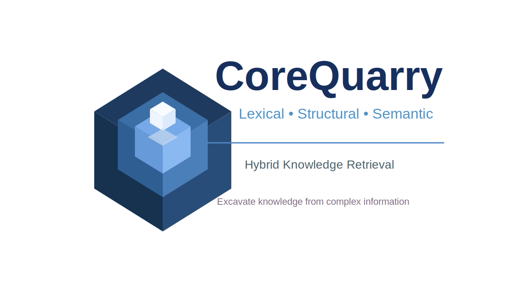

## This is the respositiory for CoreQuarry (re-Isearch+Schmate)

   Copyright 2026 Edward C. Zimmermann, NONMONOTONIC Networks, Munich, Germany
   <http://www.nonmonotonic.net>
      
   Licensed under the Apache License, Version 2.0 (the "License");
   you may not use this file except in compliance with the License.
   You may obtain a copy of the License at

       <http://www.apache.org/licenses/LICENSE-2.0>
      
   Unless required by applicable law or agreed to in writing, software
   distributed under the License is distributed on an "AS IS" BASIS,
   WITHOUT WARRANTIES OR CONDITIONS OF ANY KIND, either express or implied.
   See the License for the specific language governing permissions and
   limitations under the License.

## Description

While the Industry Consensus clamours towards Multi-Gigawatt datacenters, trillion-dollar market caps, and filling massive warehouses—if not actual outer space—with endless arrays of power-hungry GPUs. Everyone seems busy trying to figure out how to nuclear-power a cluster of 100,000 GPUs just to parse human intent. Scale at all costs.

We, by contrast, are looking the exact opposite way. We want to know: how much production-grade retrieval performance can one extract from the bare metal sitting right in front of us, off-the-grid and entirely sovereign?

The Goal: Squeezing maximum structural intelligence, deterministic precision, and state-of-the-art neural intent out of local, edge, and consumer hardware. 

CoreQuarry is a return to sane systems engineering: maximizing localized hardware to achieve identical semantic depth and absolute structural precision without a cloud tether.

CoreQuarry is not a vector data or RAG framework but a knowledge excavation platform build around a novel hybrid knowledge retrieval engine which emerged in 2026 from Project Schmate (שמאטע) for re-Isearch. It unifies lexical, structural, and semantic search into a single, high-performance platform. Unlike existing vector databases or traditional search engines, it supports true positional indexing, structure-aware queries, and typed object retrieval, enabling precise and contextually-aware search over heterogeneous document corpora. By leveraging memory-mapped, append-only indexes and a two-tier address-based caching system, the engine achieves extremely low memory footprints while scaling to handle complex, hybrid RAG queries on consumer hardware, including laptops and edge devices. 

## Code / Repro

<https://github.com/re-Isearch/CoreQuarry>

## This Repository 

This is the main central repository for CoreQuary (re-Isearch) development.

Its builds on three (actually four projects) of our projects: ib (re-Isearch), bert.cpp (our refactored bert.cpp), Schmate (which includes our HNSWlib fork).

bert.cpp in turns builds on the ggml tensor library.

## Building, installing, developing

We use cmake.. create a build subdirectory. cmake .. and make .. Should build out of the box (easier said than done).

In case you don't have ggml: 
<PRE>git clone https://github.com/ggml-org/ggml</PRE>

To install models to be used system wide:

Linux:<PRE>
sudo groupadd aimodels
sudo usermod -aG aimodels <username1>
sudo usermod -aG aimodels <username2>

sudo mkdir -p /opt/models/gguf
sudo chown -R root:aimodels /opt/models/gguf
sudo chmod -R 775 /opt/models/gguf
sudo chmod g+s /opt/models/gguf # Forces new downloads to inherit 'aimodels' group </PRE>

Models are stored in /opt/models/gguf

MaxOS: <PRE>
mkdir -p /Users/Shared/Models/gguf
chmod -R 775 /Users/Shared/Models/gguf
</PRE>

Models are stored in /User/Shared/Models/gguf

For user specific models (Linux, Unix, MacOS): <PRE> ~/.ib/models/ </PRE>

## Thanks

This project was made possible:

- Through the NGI0 Commons Fund, a fund established by NLnet with financial support from the European Commission's Next Generation Internet programme, under the aegis of DG Communications Networks, Content and Technology under grant agreement No 101135429. Additional funding is made available by the Swiss State Secretariat for Education, Research and Innovation (SERI).

- Through a Grant from the Bundesministerium für Forschung, Technologie und Raumfahrt (Germany) GRANT_NUMBER: 01IS22S32 (exploring support of the IPFS and supporting remote indexing).

- Through OpenData CH/Mercator Foundation CH.

- Through a grant from the European Commission Coordination and Support Action (CSA) on ICT standardisation (extending support for additional post ISO-8601:2019 features).

- Through the NGI0 Discovery Fund, a fund established by NLnet with financial support from the European Commission's Next Generation Internet programme, under the aegis of DG Communications Networks, Content and Technology under grant agreement No 825322

- Additional thanks to ETH Zurich SPH who housed ExoDao Network Association 2022-2025 and Amazon AWS who provided a generous hosting grant.

  &nbsp; &nbsp; 

