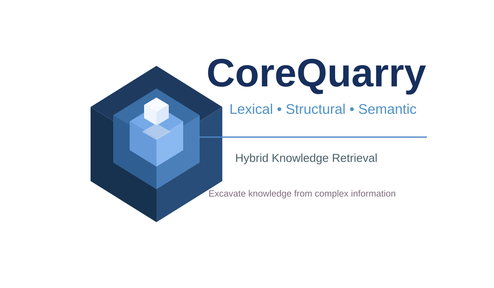

# CoreQuarry



*A search and retrieval engine for humans and agents built to run on the hardware you already own.*

Source: <https://github.com/re-Isearch/CoreQuarry> · Licensed under the [Apache License 2.0](#license)

**Contents:** [What it is](#what-it-is) · [Why local-first](#why-local-first) · [What you get](#what-you-get) · [Why did we develop this](#why-did-we-develop-this) ·  [Where it's used](#where-its-used) · [Quickstart](#quickstart) · [Why it works this way](#why-it-works-this-way) · [What this repository is built from](#what-this-repository-is-built-from) · [Building, installing and developing](#building-installing-and-developing) · [Learn more](#learn-more) · [Thanks](#thanks)

## What it is

CoreQuarry is a hybrid search and retrieval engine. Point it at a folder of documents, PDFs, Office files (such as ODF), XML, JSON, BRAT annotations, BibText, email (or nearly whatever you may have, even TAGML), and it indexes them without needing to flatten everything into a generic blob. It keeps track of where things sit inside a document: which paragraph, which field, which speaker, which record.

That structure stays available at query time, so a search can return a phrase, the section it appeared in, the person who said it, or the record it belongs to, depending on what's being asked for.

It combines three kinds of search in one engine:
- Keyword search
- Structural search (fields, paths, overlaps, record boundaries)
- Semantic vector search.

Most tools make you stitch two or three separate systems together to get all of that. CoreQuarry treats them as one problem.

And it runs *entirely on your own hardware*. No cloud service, no API key, no data leaving the building. That isn't a privacy feature bolted on afterwards; it's the reason the engine is built the way it is.

It's also built to be queried by something other than a person. Alongside the usual boolean operators, CoreQuarry adds ones like `PROMOTE`, `DEMOTE`, and `MAYBE`, designed for an LLM or agent to construct and refine a search plan step by step, rather than a human typing one query and reading the results. See [Where it's used](#where-its-used) below.

## Why local-first

Most "AI-powered search" today means sending your documents somewhere else (a hosted vector database, an LLM provider's API, etc.) for chunking and embedding. Which means your data crosses infrastructure you don't control, sits under legal jurisdictions you might not have chosen, and depends on a vendor's pricing and API both staying the same.

CoreQuarry exists to see how much of that dependency is actually necessary. It runs the full hybrid retrieval stack, keyword, structural, and semantic, on a laptop, or on something considerably smaller. We've benchmarked it on a single-board computer that draws about 50 watts.

If your organization needs its search to keep working during a network outage, or needs to be certain that sensitive documents never touch a third party's servers, that's the problem this was built to solve.


## What you get

- **Nothing must leave your infrastructure:** Documents, queries and any embeddings you generate can stay on hardware you control.
- **No vendor to get locked into:** There's no proprietary API to migrate away from if pricing or terms change.
- **Works offline, indefinitely:** Useful if a service needs to survive a regional outage, or simply never has a connection to begin with.
- **Ranking you can inspect:** You can see exactly why a result scored the way it did, rather than trust a black box.
- **Runs on hardware you probably already have:** A laptop is enough to get started; it also runs on edge devices with a fraction of that power.

## Why did we develop this

The Industry Consensus seems to crave Multi-Gigawatt datacenters, trillion-dollar market caps, and filling massive warehouses—if not actual outer space—with an endless arrays of power-hungry GPUs. From worrying about climate distruption now Everyone seems busy trying to figure out how to nuclear-power a cluster of 100,000 GPUs just to parse human intent. Scale at all costs.

We, by contrast, are looking the exact opposite way. We want to know: how much production-grade retrieval performance can one extract from the bare metal sitting right in front of us, off-the-grid and entirely sovereign?

**The Goal**: Squeezing maximum structural intelligence, deterministic precision, and state-of-the-art neural intent out of local, edge, and consumer hardware. 

CoreQuarry is a return to sane systems engineering: maximizing localized hardware to achieve identical semantic depth and absolute structural precision without a cloud tether.

Retrieval-Augmented Generation (RAG) was introduced by Meta AI in 2020 to solve the issue of Large Language Models hallucinating and lacking up-to-date knowledge. It works by fetching relevant facts from an external database and merging them with the user's prompt, though early versions suffered from fragmentation and retrieval errors, leading to RAG 2.0-- adding lexical search, knowledge graphs and an agentic loop-- and lately some so-called 3.0 architectures (orchestration).  At the heart of most of these systems is a traditional structureless lexical search using an inverted index and score normalization using BM25 or TD-IDF. These systems don't use structure or position since their basic algorithms are inadaquate to the task. They build instead on the notion that a re-ranker-- most commonly Reciprocal Rank Fusion (RRF)--  can make up for the loss.  We advocate, by contrast, deterministic, context-aware structure traversal. The engine should treat  a document not as an arbitrary bag of words or vector space, but as a rigid multi-dimensional map.  A positional index acts like a persistent physical grid. It allows the generation engine to mathematically trace a fact back to its coordinates. Location-storing structural engines can map the exact geometric coordinate of every string, completely eliminating guessed or hallucinated citations.

CoreQuarry, in this sense, is not a vector data or RAG framework but a knowledge excavation platform. It is built around a novel hybrid knowledge retrieval engine which emerged in 2026 from Project Schmate (שמאטע) for re-Isearch. It unifies lexical, structural, and semantic search into a single, high-performance platform. Unlike existing vector databases or traditional search engines, it supports true positional indexing, structure-aware queries, and typed object retrieval, enabling precise and contextually-aware search over heterogeneous document corpora. By leveraging memory-mapped, append-only indexes and a two-tier address-based caching system, the engine achieves extremely low memory footprints while scaling to handle complex, hybrid RAG queries on consumer hardware, including laptops and edge devices. 

Our design paradigm is especially suited to the emerging next generation of **LLM** and **RL agents**. Agents need more than keyword matching. They need to express relationships: this term occurs inside that field, these concepts appear near each other, this phrase comes before that phrase, these facts belong to the same structural element. Positional and structural operators let an agent ask about the shape of information, not merely its presence.

LLMs, by contrast, tend to see retrieved text as relatively flat. Once content is turned into tokens, chunks, or embeddings, much of the original document structure—fields, containment, adjacency, order, hierarchy—can become weak or implicit. An LLM may infer those relationships, but inference is not the same as querying them precisely. Information signals for context are literally thrown out but to have downstream processes try to re-infer what may have originally been there.

Structural and positional search gives, by contrast, an agent a way to preserve that information before generation: retrieve the right relationship, not just the right words. For agentic search, operators such as NEAR, BEFORE, PEER, WITHIN, and field constraints are therefore not syntactic luxuries; they are tools for turning a flat language model into a much more precise information-seeking system.

CoreQuarry is built to act as the mathematically precise, structurally permanent bedrock underneath whatever model generation layer you choose to run. It tracks exact physical positions of terms, structures (implicit and explicit via SGML, XML, TAGML, JSON etc), and document schemas. An agent looking for an exact structural match gets a perfect algorithmic return, while the Schmate sub-engine handles the semantic search alongside it.

- This paradigm lets the agent actively construct and refine expressive retrieval plans using Boolean, structural, positional, scoring, and relaxation operators.
- The key idea is that the agent is no longer just consuming retrieved context. It is programming the retrieval process:
> "RAG gave LLMs documents. CoreQuarry  gives agents a retrieval algebra."


To this end:

* CoreQuarry uses positional ranking rather than just BM25-based ranking (which is merely a Bag-of-Words retrieval model summing individual term contributions without concern for their position withing a corpus). Because BM25 lacks positional awareness, it cannot distinguish between different meanings that depend on word order or positional context.

* Structure-Preserving Indexing: Unlike conventional vector databases and many RAG systems that flatten documents into chunks or JSON records, CoreQuarry preserves document structure during indexing. Sections, headings, positional relationships, metadata, object types, and document hierarchies remain available to the query engine.

See our Constitution/Manifesto (in docs/CoreQuarryManifesto.pdf)

<PRE>
CoreQuarry / IB
    authoritative documents
    fields / GP coordinates
    deletion state
    persistence semantics
             |
             v
Schmate
    model management
    text reconstruction
    embedding/chunk semantics
    shard management
    metadata + model identity
    vector persistence/rescoring
    synchronization / GC
             |
             v
modified HNSWLIB
    graph
    ANN traversal
    filtering/deletion hooks
    richer vector representations
    quantization/storage-aware spaces
    CPU/vectorized distance machinery
</PRE>


## Where it's used

- **Grounding an LLM or RAG pipeline** with an exact passage instead of an arbitrary 500-byte chunk. Because CoreQuarry indexes structure rather than just text, it can hand back "the third paragraph of section four" instead of whatever window a generic chunker happened to cut.
- **Agentic, recursive search.** An agent can issue a query, look at what came back, and narrow or redirect the next one using CoreQuarry's own operators, rather than re-embedding and re-querying a vector store from scratch each time. That's a different shape of use than a person typing one search and reading the results, and it's the direction most of the engine's recent development has gone.
- **Large scientific and geospatial datasets.** Earlier versions of this engine's search core have indexed national genomic archives and observatory data, where records rarely look like tidy prose.
- **Legal, government and archival collections**, where knowing precisely where a result came from matters as much as finding it.
- **Edge and embedded deployments** with no spare GPU and no guaranteed network connection: field equipment, offline research stations, point-of-sale systems.

It delivers:
* A powerful query algebra fusing the benefits of NoSQL, Graph and semantic search. It explicitly shifts the paradigm from simple query-response retrieval to a programmable retrieval algebra.  
* Immutable Infrastructure: On-prem code bases can be frozen in time, ensuring that search and retrieval tools remain functional and identical for decades.
* Offline Resiliency: Many services must function during regional internet outages or infrastructure failures; local setups ensure internal search operations never go offline.
* Energy Efficiency: CoreQuarry is designed to enable highly capable local AI systems with a fraction of the energy consumption of conventional cloud deployments. By enabling operation at any point on the retrieval quality–efficiency frontier, CoreQuarry allows organisations to optimise not only for accuracy and cost, but also for energy consumption, deployment constraints, and digital sovereignty requirements.


## Quickstart

This walks through building CoreQuarry and running your first search. It assumes a Unix-like system (Linux or macOS) with `git`, `cmake`, and a C++17-capable compiler already installed.

### 1. Get the code

```bash
git clone --recurse-submodules https://github.com/re-Isearch/CoreQuarry.git
cd CoreQuarry
```

CoreQuarry is built from three of its own sub-projects (`ib`, `Schmate`, `bert.cpp`) plus the external `ggml` tensor library. `ggml` is now a pinned submodule like the rest, so the single clone command above brings in everything at a known-compatible set of versions. You don't need to clone it separately.

(See [What this repository is built from](#what-this-repository-is-built-from) for what each piece does.)

### 2. Build it

```bash
mkdir -p build && cd build
cmake ..
make
cd ..
```

This produces the command-line tools inside `ib/bin/`, including `quarry`, the main entry point.


### 3. Index something

```bash
./ib/bin/quarry index -d /tmp/corequarry-demo README.md
```

This builds an index from this repository's own `README.md` into `/tmp/corequarry-demo`. `-d` sets the index location. Point `index` at any folder of your own documents to try it on something real.

## 4. Search it

```bash
./ib/bin/quarry search -d /tmp/corequarry-demo -show knowledge
```

This searches the index you just built and shows the matching passage in context. `-show` prints the hit with a snippet of surrounding text rather than just a score.

This covers keyword and structural search. Semantic search layers on top once a model is configured, see [model paths](#model-paths) below, and the [Handbook](https://github.com/re-Isearch/ib/blob/main/docs/re-Isearch-Handbook.odt) in the `ib` repository for the fuller query syntax, including the agent-oriented operators mentioned above.


## Why it works this way

**Structure survives, instead of getting flattened.** Most search platforms convert a document into some intermediate form (commonly JSON), pull a few fields out of it for indexing, and store the rest as a blob to be re-parsed on every retrieval. CoreQuarry instead records where things live inside the original document and reconstructs them on request. That's also why it can take a document in as JSON and hand it back as XML: it isn't storing a copy of your JSON, it's storing the underlying structure your JSON happened to express.

**Position matters.** Conventional keyword search (BM25, the ranking behind most Lucene-based tools including Elasticsearch) scores a document by counting term occurrences, with no notion of where those terms sit relative to each other. A hundred-page document with "database" on page one and "engine" on page ninety-nine scores identically to one where the two words sit side by side. CoreQuarry's own ranking accounts for position instead, so proximity and structure genuinely count towards relevance. BM25-style normalization is available too, for cases like standard IR benchmarks where that's specifically what's being measured, but it isn't the default.

**Lexical and vector search share one engine, deliberately.** Most RAG pipelines embed everything into a single vector space, which tends to produce what's sometimes called semantic collapse: once a collection gets large enough, the vectors blur together and lose the distinctions that were obvious to begin with. CoreQuarry only vectorizes what actually benefits from it, typically prose fields, and gives other data types purpose-built indexes instead: phonetic matching for names, range indexes for dates, bounding boxes for geospatial data. A field only gets embedded if embedding it makes sense.


**It's fast, on hardware you already have.** Benchmarked on an Apple M1 Pro (16GB RAM, no server-grade hardware) against 768-dimension vectors:

| Engine | Approx. QPS |
|---|---|
| Elasticsearch | under 2,000 |
| Qdrant | 1,000–3,000 |
| Milvus | 2,000–5,000 |
| FAISS | 5,000–10,000 |
| CoreQuarry | 13,000 |


On a single thread, comparing CoreQuarry's HNSW implementation directly against FAISS's own on a one-million-vector set: CoreQuarry sustains around 3,000 queries per second against FAISS's 200–600. Full methodology, further benchmarks, and results on lower-power hardware are in the [Briefing](docs/CoreQuarryBriefing.pdf).


## What this repository is built from

CoreQuarry is the meeting point of three sub-projects, each usable on its own:

- **[`ib`](https://github.com/re-Isearch/ib)** is the core lexical and structural search engine, the part with the thirty-year history. It handles indexing, document structure, and query processing on its own, with no vector search required.
- **[`Schmate`](https://github.com/re-Isearch/Schmate)** is the vector-search engine, built on `bert.cpp`, `llama.cpp`, and CoreQuarry's own fork of HNSWlib.
- **HNSWlib** (bundled inside Schmate) started as Yury Malkov's reference implementation and has been heavily optimised and extended with SIMD instructions and quantisation support.
- **[`bert.cpp`](https://github.com/re-Isearch/bert.cpp)** runs the embedding models that Schmate searches over, built on the [ggml](https://github.com/ggml-org/ggml) tensor library, with CUDA, Metal and Vulkan backends.


You don't need to think about this split day to day, `quarry` ties all three together, but it explains why the build needs several repositories rather than one, and why a lexical-only deployment is possible without the vector stack at all.

## Building, installing and developing

If you followed the [quickstart](#quickstart) above, you already have a working build. This section covers the parts that quickstart skips: where models live on disk, keeping submodules current, and a smaller-footprint option.


### Model paths

CoreQuarry looks for `.gguf` embedding models in specific locations, depending on your setup.

**System-wide on Linux**, shared across users via a dedicated group:

```bash
sudo groupadd aimodels
sudo usermod -aG aimodels <username>          # repeat per user
sudo mkdir -p /opt/models/gguf
sudo chown -R :aimodels /opt/models/gguf
sudo chmod -R 775 /opt/models/gguf
```


Group membership only takes effect after logging out and back in.

**System-wide on macOS:**

```bash
mkdir -p /Users/Shared/Models/gguf
chmod -R 775 /Users/Shared/Models/gguf
```


**Per-user, on any of the above**, if you'd rather not install system-wide: place models under `~/.ib/models/`, and CoreQuarry will find them there automatically.

### Keeping submodules current

The submodules are updated frequently. A plain `git pull` on this repository will leave them behind, so pull the latest from each submodule's `main` branch explicitly:

```bash
git submodule update --remote --merge
```

### A smaller-footprint, lexical-only build


If you don't need semantic search, `ib` can be built entirely on its own, without Schmate, `bert.cpp`, or `ggml`, for a considerably smaller runtime footprint. See the [`ib` repository](https://github.com/re-Isearch/ib) for that build path directly.

<!-- DRAFT NOTE for Jon: CoreQuarry's own CMakeLists.txt currently exits with a fatal error if ggml isn't present, so this lightweight path only works by building ib directly rather than through CoreQuarry's own build. Worth confirming with Edward whether a lexical-only build through CoreQuarry itself is on the roadmap, since the Briefing document advertises "lexical-only: min ~8MB" as a CoreQuarry capability, not just an ib one. -->

## Learn more


- **[Constitution](docs/CoreQuarryManifesto.pdf)**: the underlying principles behind how CoreQuarry treats data, retrieval and provenance, for anyone who wants the reasoning behind the architecture, not just the architecture.
- **[Glossary](docs/CoreQuarryGlossary.pdf)**: short, precise definitions for the terms used across these documents (artifact, essence, provenance, and so on).
- **[Briefing](docs/CoreQuarryBriefing.pdf)**: the full technical write-up covering architecture, benchmarking methodology, comparisons against other engines, and hardware notes.

## Thanks

- Through the NGI0 Commons Fund, a fund established by NLnet with financial support from the European Commission's Next Generation Internet programme, under the aegis of DG Communications Networks, Content and Technology under grant agreement No 101135429. Additional funding is made available by the Swiss State Secretariat for Education, Research and Innovation (SERI).
- Through a grant from the Bundesministerium für Forschung, Technologie und Raumfahrt (Germany), grant number 01IS22S32, exploring support for IPFS and remote indexing.
- Through OpenData CH / Mercator Foundation CH.
- Through a grant from the European Commission Coordination and Support Action (CSA) on ICT standardisation, extending support for additional post-ISO-8601:2019 features.
- Through the NGI0 Discovery Fund, a fund established by NLnet with financial support from the European Commission's Next Generation Internet programme, under the aegis of DG Communications Networks, Content and Technology, under grant agreement No 825322.
- Additional thanks to ETH Zurich SPH, who housed the ExoDao Network Association from 2022 to 2025, and to Amazon AWS, who provided a generous hosting grant.


  &nbsp; &nbsp;  

---


<a id="license"></a>
### License

Copyright 2026 Edward C. Zimmermann, NONMONOTONIC Networks, Munich, Germany
<http://www.nonmonotonic.net>

Licensed under the Apache License, Version 2.0 (the "License"); you may not use this file except in compliance with the License. You may obtain a copy of the License at

<http://www.apache.org/licenses/LICENSE-2.0>

Unless required by applicable law or agreed to in writing, software distributed under the License is distributed on an "AS IS" BASIS, WITHOUT WARRANTIES OR CONDITIONS OF ANY KIND, either express or implied. See the License for the specific language governing permissions and limitations under the License.

